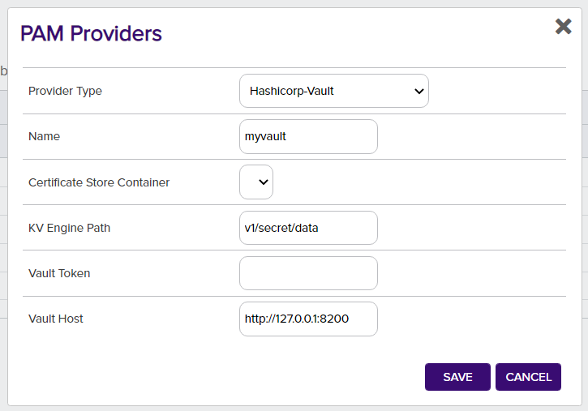
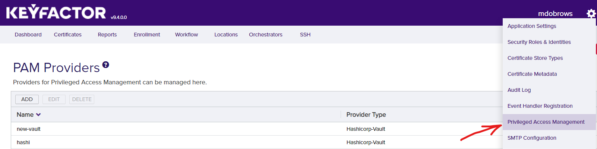
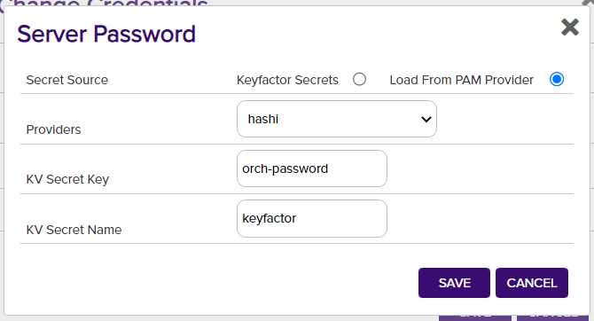

# Hashicorp Vault PAM Provider

The Hashicorp Vault PAM Provider allows for the retrieval of stored account credentials from a Hashicorp Vault Secret store. A valid token with access to the secrets in the Vault is used to retrieve secrets from a specific secret path in the Vault.

#### Integration status: Production - Ready for use in production environments.


## About the Keyfactor PAM Provider

Keyfactor supports the retrieval of credentials from 3rd party Privileged Access Management (PAM) solutions. Secret values can normally be stored, encrypted at rest, in the Keyfactor Platform database. A PAM Provider can allow these secrets to be stored, managed, and rotated in an external platform. This integration is usually configured on the Keyfactor Platform itself, where the platform can request the credential values when needed. In certain scenarios, a PAM Provider can instead be run on a remote location in conjunction with a Keyfactor Orchestrator to allow credential requests to originate from a location other than the Keyfactor Platform.


## Support for Hashicorp Vault PAM Provider

Hashicorp Vault PAM Provider is supported by Keyfactor for Keyfactor customers. If you have a support issue, please open a support ticket with your Keyfactor representative.

###### To report a problem or suggest a new feature, use the **[Issues](../../issues)** tab. If you want to contribute actual bug fixes or proposed enhancements, use the **[Pull requests](../../pulls)** tab.


---


#### Compatibility
This release requires Keyfactor version 9.10 or greater.
This release was tested against Hashicorp Vault version 1.9.4.
Using this on a Universal Orchestrator requires UO version 10.1 or greater.

### Initial Configuration of PAM Provider
In order to allow Keyfactor to use the new Hashicorp Vault PAM Provider, the definition needs to be added to the application database.
This is done by running the provided `kfutil` tool to install the PAM definition, which only needs to be done one time. It uses API credentials to access the Keyfactor instance and create the PAM definition.

The `kfutil` tool, after being [configured for API access](https://github.com/Keyfactor/kfutil#quickstart), can be run in the following manner to install the PAM definition from the Keyfactor repository:

```
kfutil pam types-create -r hashicorp-vault-pam -n Hashicorp-Vault
```

### Configuring Parameters
The following are the parameter names and a description of the values needed to configure the Hashicorp Vault PAM Provider.

__Initialization Parameters for each defined PAM Provider instance__
| Initialization parameter | Display Name | Description |
| :---: | :---: | --- |
| Host | Vault Host | The IP address or URL of the Vault instance, including any port number |
| Token* | Vault Token | The access token for the Vault  *For token auth only.  Not needed for Kerberos auth.|
| Path | KV Engine Path | The path to secrets in the Vault. By default this would be at 'v1/secret/data' |


__Instance Parameters for each retrieved secret field__
| Instance parameter | Display Name | Description |
| :---: | :---: | --- |
| Secret | KV Secret Name | The name of the secret in the Vault |
| Key | KV Secret Key | The key to the key-value pair of the secret to access |



### Configuring for PAM Usage
#### In Hashicorp Vault
When configuring the Hashicorp Vault for use as a PAM Provider with Keyfactor, you will need to set up and configure the `kv` functionality in Vault. You will need an API Key that has the right permissions. The default `secret` location can be used, or another location.

After adding a secret object to `kv` with a key and value, you can use the object's name (the "KV Secret Name") and the secret's key (the "KV Secret Key") to retrieve credentials from the Hashicorp Vault as a PAM Provider.

#### On Keyfactor Universal Orchestrator
##### Installation
Configuring the UO to use the Hashicorp Vault PAM Provider requries first installing it as an extension by copying the release contents into a new extension folder named `Hashicorp-Vault`.
A `manifest.json` file is included in the release. This file needs to be edited to enter in the "initialization" parameters for the PAM Provider. Specifically values need to be entered for the parameters in the `manifest.json` of the __PAM Provider extension__:

~~~ json
"Keyfactor:PAMProviders:Hashicorp-Vault:InitializationInfo": {
    "Host": "http://127.0.0.1:8200",
    "Path": "v1/secret/data",
    "Token": "xxxxxx"
  }
~~~

##### Usage
To use the PAM Provider to resolve a field, for example a Server Password, instead of entering in the actual value for the Server Password, enter a `json` object with the parameters specifying the field.
The parameters needed are the "instance" parameters above:

~~~ json
{"Secret":"my-kv-secret","Key":"myServerPassword"}
~~~

If a field supports PAM but should not use PAM, simply enter in the actual value to be used instead of the `json` format object above.

#### In Keyfactor - PAM Provider
##### Installation
In order to setup a new PAM Provider in the Keyfactor Platform for the first time, you will need to run the `kfutil` tool (see Initial Configuration of PAM Provider).

After the installation is run, the DLLs need to be installed to the correct location for the PAM Provider to function. From the release, the hashicorp-vault-pam.dll should be copied to the following folder locations in the Keyfactor installation. Once the DLL has been copied to these folders, edit the corresponding config file. You will need to add a new Unity entry as follows under `<container>`, next to other `<register>` tags.

| Install Location | DLL Binary Folder | Config File |
| --- | --- | --- |
| WebAgentServices | WebAgentServices\bin\ | WebAgentServices\web.config |
| Service | Service\ | Service\CMSTimerService.exe.config |
| KeyfactorAPI | KeyfactorAPI\bin\ | KeyfactorAPI\web.config |
| WebConsole | WebConsole\bin\ | WebConsole\web.config |

When enabling a PAM provider for Orchestrators only, the first line for `WebAgentServices` is the only installation needed.

The Keyfactor service and IIS Server should be restarted after making these changes.

```xml
<register type="IPAMProvider" mapTo="Keyfactor.Extensions.Pam.Hashicorp.VaultPAM, hashicorp-vault-pam" name="Hashicorp-Vault" />
```


##### Usage
In order to use the PAM Provider, the provider's configuration must be set in the Keyfactor Platform. In the settings menu (upper right cog) you can select the ___Priviledged Access Management___ option to configure your provider instance.



After it is set up, you can now use your PAM Provider when configuring certificate stores. Any field that is treated as a Keyfactor secret, such as server passwords and certificate store passwords can be retrieved from your PAM Provider instead of being entered in directly as a secret.




---


